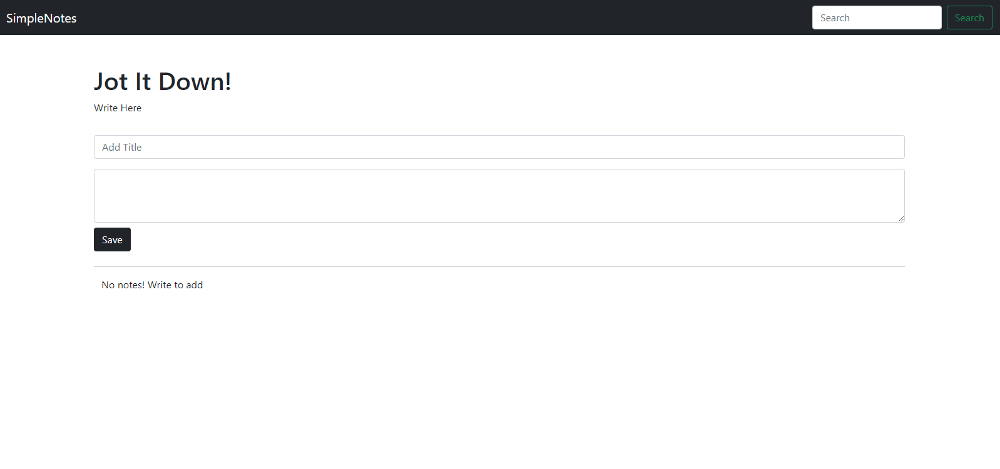

# SimpleNotes

SimpleNotes is a lightweight notes taking app built with HTML, Bootstrap, JavaScript, and Node.js. This app allow users to create, view, edit, and delete notes, making it easy to keep track of their thoughts and tasks.





## Getting Started

### Prerequisites
You need to have [Node.js](https://nodejs.org/) installed on your system.

### Installation

1. Clone this repository to your local machine:

   ```bash
   git clone https://github.com/taexj/SimpleNotes.git

2. Navigate to the project directory:
   
    ```bash
   cd SimpleNotes

3. Install the required dependencies:

    ```bash
   npm install

### Directory Structure

```SimpleNotes/
|-- public/
|   |-- index.html
|   |-- app.js
|-- server.js
|-- package.json


